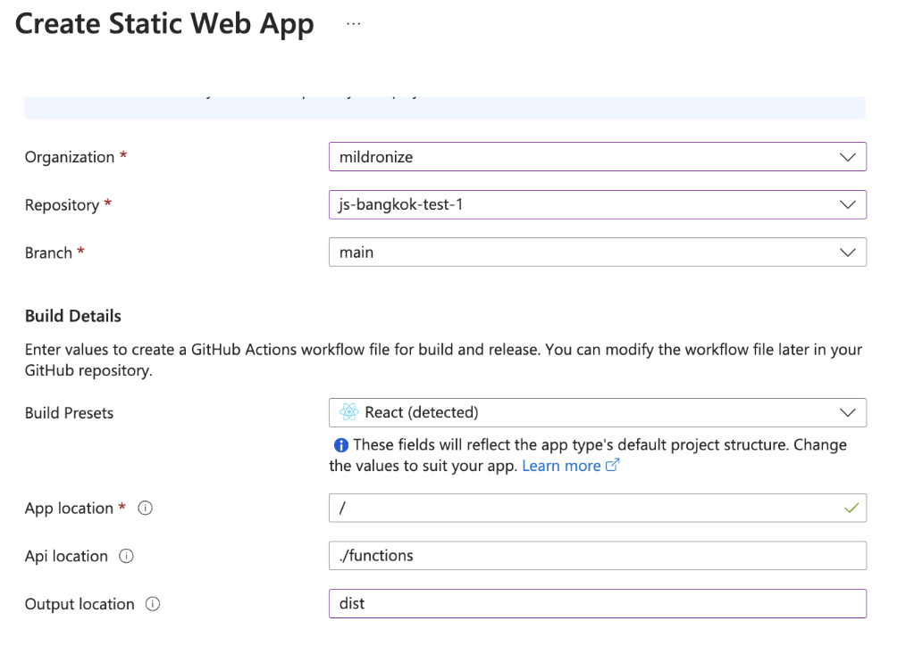
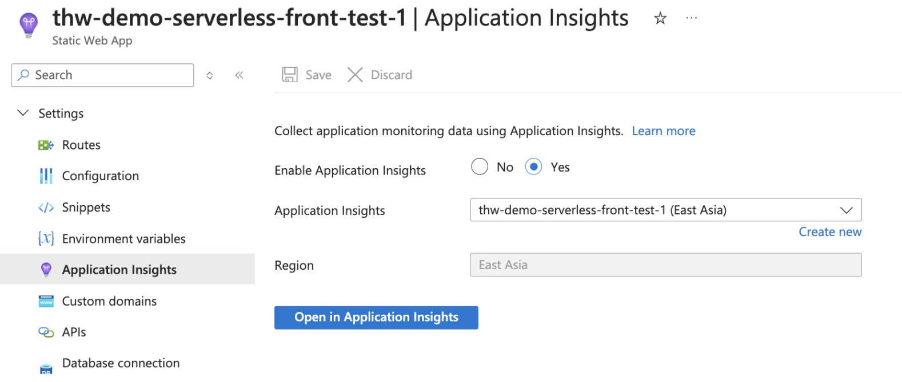

# End-to-End Type-Safe on Azure Static Web App

This project demonstrates how to set up a **Type-Safe** full-stack web application using **Azure Static Web Apps** and **tRPC**, following the principles of the **T3 Stack**.

## Features

- Local development with **React** + **Vite** + **TypeScript**
- Backend API powered by **Azure Functions**
- Full type safety from frontend to backend using **tRPC**
- Deployment via **GitHub Actions**
- Example frontend fetching data from backend APIs
- Scalable serverless platform with **Azure**

## Tech Stack

### Libraries & Tools

- **Vite** + **React**
- **TypeScript**
- **tRPC v10**
- **React Query v4**
- **Azure Functions v4**
- [**trpc-azure-functions-adapter**](https://github.com/thaitype/trpc-azure-functions-adapter)

### Platform

- **Azure Static Web Apps**
- **Azure Functions**

## Getting Started

### Prerequisites

- Node.js v20+ installed
- Yarn (or npm)

### Run Locally

1. Install dependencies:
    
    ```bash
    yarn
    ```
    
2. Start the development server:
    
    ```bash
    yarn dev
    ```
    
3. Open your browser and navigate to:
    
    ```
    http://localhost:5173/
    ```
    

### Build for Production

To create an optimized production build:

```bash
yarn build
```

## Deploy to Azure Static Web App

1. **Fork the Template**: Start by forking this [template](https://github.com/thaitype/azure-staticwebapp-trpc).
2. **Create a Static Web App**: Set up an Azure Static Web App linked to your GitHub repository. Follow the instructions in the [Azure documentation](https://learn.microsoft.com/en-us/azure/static-web-apps/deploy-react?pivots=github) to configure Continuous Integration with GitHub Actions.
    
3. **Edit Code and Deploy**: Make changes to the code, push commits, or create Pull Requests. Azure will automatically build and deploy each PR preview. Close PRs to merge changes into production.
4. **Enable Monitoring**: Enable **Application Insights** for performance and error monitoring in production.
    

## Demo

You can see a live demo of the app at:

[Live Demo](https://victorious-water-019ecb600-preview.eastasia.5.azurestaticapps.net/)

## Note

### tRPC
> but note that you cannot use trpc v10 with react-query v5, they are structurally incompatible. the trpc team is working on v11, which will be RQ v5 compatible. You can already try it out with the @trpc/react-query@next tag.
https://github.com/TanStack/query/issues/6186#issuecomment-1772356489

### Azure SWA CLI

The slow method using Azure Static Web Apps CLI as a reverse proxy to the Vite server
https://github.com/Azure/static-web-apps-cli/issues/736

```json
{ 
  "scripts": {
    "dev": "run-p -l 'dev:*'",
    "start": "vite",
    "build:api": "esbuild src/server/main.ts --bundle --platform=node --external:@azure/functions-core --outfile=src/server/dist/main.js",
    "dev:swa": "swa start http://localhost:5173 --run \"npm run start\" --api-location src/server --port 3000 --api-devserver-url http://127.0.0.1:3030",
    "dev:func": "run-s build:api && nodemon --watch src/server --ext ts --exec 'run-s build:api'",
    "dev:start": "func start -w --prefix src/server/ --cors-credentials --port 3030"
  }
}
```

### Github Actions 
Due to issue with Github Actions Azure/static-web-apps-deploy@v1 with file `staticwebapp.config.json`
https://github.com/Azure/static-web-apps/issues/1452#issuecomment-2064670359 

If we want to use the Github Actions, to add `staticwebapp.config.json` file with `{}` value

### SWA Alternatives

[Static Web Apps CLI: improve performance with Vite server proxy](https://johnnyreilly.com/static-web-apps-cli-improve-performance-with-vite-server-proxy)
  - Use Vite to proxy requests to the Azure Functions backend instead of the SWA CLI

### T3 Stack

Some code and patterns are inspired by the T3 Stack, and Next.js Struture